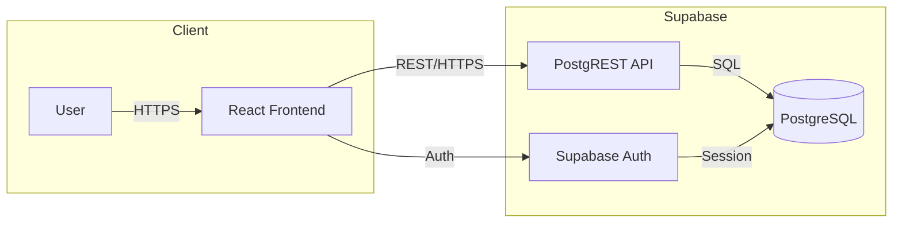

# Utah Nexus

## App Summary

Utah residents often receive fragmented, sometimes biased local news from multiple outlets. Utah Nexus solves this by aggregating Utah local news from multiple sources and presenting it in a balanced, easy-to-digest format. The primary user is a Utah resident who wants to stay informed about local issues—housing, the Great Salt Lake, education, air quality, tech growth, and public lands—without wading through conflicting narratives. Utah Nexus provides AI-generated summaries that highlight shared facts across sources, surfaces divergent narratives, and enables side-by-side comparison of coverage from Salt Lake Tribune, Deseret News, KSL, and Utah Policy. The product helps users form their own informed opinions by seeing the full picture.

## Tech Stack

| Layer | Technology |
|-------|------------|
| **Frontend** | React 19, Vite 7, TypeScript 5.9, Tailwind CSS, Radix UI, React Router |
| **Backend** | Supabase (PostgREST API, PostgreSQL) |
| **Database** | PostgreSQL (hosted on Supabase) |
| **Authentication** | Supabase Auth (Anonymous sign-in for profile demo) |
| **External Services** | Supabase |

## Architecture Diagram



## Prerequisites

- **Node.js** 18+ ([Install](https://nodejs.org/))
- **npm** (included with Node.js)
- **Supabase account** ([Sign up](https://supabase.com/))

Verify installation:

```bash
node -v   # v18.x or higher
npm -v    # 9.x or higher
```

## Installation and Setup

1. **Clone the repository**

   ```bash
   git clone https://github.com/DrFunDip72/401-Milestone-6.git
   cd 401-Milestone-6
   ```

2. **Install dependencies**

   ```bash
   cd utah-nexus
   npm install
   ```

3. **Create Supabase project** (if not already done)

   - Go to [Supabase Dashboard](https://supabase.com/dashboard)
   - Create a new project
   - Note your project URL and anon (public) key

4. **Configure environment variables**

   ```bash
   cp .env.example .env
   ```

   Edit `.env` and set:

   ```
   VITE_SUPABASE_URL=https://your-project.supabase.co
   VITE_SUPABASE_ANON_KEY=your_anon_key
   ```

5. **Create the database**

   - In Supabase Dashboard, go to **SQL Editor**
   - Run the contents of `db/schema.sql`
   - Run the contents of `db/seed.sql`

6. **Enable Anonymous Auth**

   - In Supabase Dashboard, go to **Authentication** → **Providers**
   - Enable **Anonymous Sign-Ins**

## Running the Application

```bash
cd utah-nexus
npm run dev
```

Open [http://localhost:5173](http://localhost:5173) in your browser.

## Verifying the Vertical Slice

The **Profile Save Changes** button demonstrates the full backend flow:

1. Navigate to **Profile** (via header or `/profile`)
2. Fill in Name, Email, Date of Birth, and Utah County
3. Click **Save Changes**
4. Confirm the success toast appears
5. **Refresh the page** — the form should show your saved values
6. (Optional) In Supabase Dashboard → **Table Editor** → `User`, verify your row exists

This confirms: frontend → backend (Supabase) → database → updated value returned → UI reflects the change and persists after refresh.
